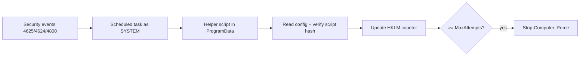

## Security audit: [`TamperGuard.ps1`](TamperGuard.ps1:1)

Inputs reviewed: [`TamperGuard.ps1`](TamperGuard.ps1:1) + prior notes in [`security_curcus.md`](security_curcus.md:1) + installer helpers [`run.bat`](run.bat:1) and [`README.md`](README.md:1).

### Architecture summary (what runs as SYSTEM)
- Installer path: [`Register-TamperGuard`](TamperGuard.ps1:193) writes helper scripts under [`$SecureDir`](TamperGuard.ps1:21), stores config in [`$ConfigPath`](TamperGuard.ps1:23), stores counter in [`$CounterPath`](TamperGuard.ps1:22), and registers 3 scheduled tasks.
- Runtime path: task XML in [`$xmlFail`](TamperGuard.ps1:413), [`$xmlReset`](TamperGuard.ps1:448), [`$xmlLock`](TamperGuard.ps1:484) runs `powershell.exe` as SYSTEM (`S-1-5-18`) with `-ExecutionPolicy Bypass`.



### Strengths (aligned with stated threat model)
- Fail-secure on missing config and missing/mismatched script hash is implemented inside the generated scripts in [`$scriptFailContent`](TamperGuard.ps1:216), [`$scriptResetContent`](TamperGuard.ps1:289), [`$scriptLockContent`](TamperGuard.ps1:346).
- Tasks run under SYSTEM via `<UserId>S-1-5-18</UserId>` (see [`$xmlFail`](TamperGuard.ps1:413)).
- Counter updates are serialized with a named mutex in generated scripts (see mutex code embedded in [`$scriptFailContent`](TamperGuard.ps1:216)).
- Max attempts input is bounded by [`Get-ValidatedMaxAttempts`](TamperGuard.ps1:98) + [`Normalize-MaxAttempts`](TamperGuard.ps1:86).

---

## Findings (ranked)

### 1) CRITICAL — Local privilege escalation via pre-created ProgramData directory
**Where:** [`Ensure-SecureStorage`](TamperGuard.ps1:26) applies hardened ACLs only when the directory does *not* exist.

**Impact:** A low-privileged local user can pre-create the directory behind [`$SecureDir`](TamperGuard.ps1:21) with permissive ACLs. Then the installer path in [`Register-TamperGuard`](TamperGuard.ps1:193) will write helper scripts into a directory still writable by the attacker. Because scheduled tasks execute those helper scripts as SYSTEM (task actions in [`$xmlFail`](TamperGuard.ps1:413)), this becomes **arbitrary code execution as SYSTEM**.

**Fix priority:** Highest. Make [`Ensure-SecureStorage`](TamperGuard.ps1:26) always enforce ACL/owner, even if the directory already exists; validate the directory is not writable by non-admins before writing scripts or registering tasks (fail closed if insecure).

### 2) HIGH — Config JSON corruption not handled as tamper
**Where:** JSON parsing in [`Get-Config`](TamperGuard.ps1:137) and the `ConvertFrom-Json` usage embedded in generated scripts (see [`$scriptFailContent`](TamperGuard.ps1:216)).

**Impact:** Invalid JSON can cause errors that may stop logic before shutdown/increment, potentially disabling protection or creating inconsistent behavior.

**Fix:** Wrap config loads in try/catch; treat parse failure as tamper (log + shutdown) inside the helper scripts, and as a repairable error in the interactive installer UI.

### 3) MEDIUM — Named mutex can be used for DoS / bypass-by-timeout
**Where:** `Global\TamperGuard_Counter` mutex in generated scripts (embedded in [`$scriptFailContent`](TamperGuard.ps1:216)).

**Impact:** If an attacker can hold/pre-create the mutex (or influence its security descriptor), the SYSTEM script may time out and throw, preventing increments/shutdown. At minimum, this is a reliability/DoS vector.

**Fix:** Create the mutex with an explicit secure ACL and/or treat timeout as fail-secure instead of exiting.

### 4) LOW — Scheduled task uses non-absolute PowerShell path
**Where:** `<Command>powershell.exe</Command>` inside task XML in [`$xmlFail`](TamperGuard.ps1:413) (same pattern in [`$xmlReset`](TamperGuard.ps1:448), [`$xmlLock`](TamperGuard.ps1:484)).

**Fix:** Use a fully qualified path to the intended PowerShell binary.

### 5) LOW — Previously noted minor issues remain (cosmetic / low risk)
From [`security_curcus.md`](security_curcus.md:26): `$false` escaping consistency in generated scripts, clarify intentional expansion of [`$ShutdownLogPath`](TamperGuard.ps1:24) inside here-strings, safer hash property access, and input validation for [`Show-FailedAttempts`](TamperGuard.ps1:558).

---

## Bottom line
For the stated “casual physical-access” model, the logic is broadly sound, but **Finding #1 is a serious security flaw** because it enables a standard user to turn this into SYSTEM code execution by pre-creating the directory referenced by [`$SecureDir`](TamperGuard.ps1:21) before installation.


====================
ANswer2:

# Security Audit Report: TamperGuard v3.1 - Critical Findings

## Executive Summary

The new audit identified a **critical privilege escalation vulnerability** that must be fixed before deployment. The script's security model assumes it creates the directory, but an attacker can pre-create it with malicious permissions.

---

## 🔴 CRITICAL - Finding #1: Directory Pre-Creation Attack

### The Vulnerability

```powershell
function Ensure-SecureStorage {
    if (-not (Test-Path $SecureDir)) {  # ← Only sets ACLs if directory doesn't exist!
        New-Item -Path $SecureDir -ItemType Directory -Force | Out-Null
        # ... ACL setup ...
    }
}
```

### Attack Scenario

```powershell
# Attacker (as standard user) runs BEFORE admin installs TamperGuard:
New-Item -Path "$env:ProgramData\TamperGuard" -ItemType Directory -Force

# Directory now exists with inherited permissions (Users can write)
# When admin runs Register-TamperGuard, Ensure-SecureStorage skips ACL setup
# Attacker can now modify scripts that run as SYSTEM
```

### Complete Fix

```powershell
function Ensure-SecureStorage {
    $expectedOwner = [System.Security.Principal.NTAccount]"BUILTIN\Administrators"
    
    # Define the secure ACL we want
    $inheritance = [System.Security.AccessControl.InheritanceFlags]::ContainerInherit -bor `
                   [System.Security.AccessControl.InheritanceFlags]::ObjectInherit
    $propagation = [System.Security.AccessControl.PropagationFlags]::None
    $allowType = [System.Security.AccessControl.AccessControlType]::Allow

    $secureAcl = New-Object System.Security.AccessControl.DirectorySecurity
    $secureAcl.SetAccessRuleProtection($true, $false)  # Disable inheritance
    $secureAcl.SetOwner($expectedOwner)
    
    $secureAcl.AddAccessRule((New-Object System.Security.AccessControl.FileSystemAccessRule(
        "BUILTIN\Administrators",
        [System.Security.AccessControl.FileSystemRights]::FullControl,
        $inheritance, $propagation, $allowType)))
    
    $secureAcl.AddAccessRule((New-Object System.Security.AccessControl.FileSystemAccessRule(
        "NT AUTHORITY\SYSTEM",
        [System.Security.AccessControl.FileSystemRights]::FullControl,
        $inheritance, $propagation, $allowType)))
    
    $secureAcl.AddAccessRule((New-Object System.Security.AccessControl.FileSystemAccessRule(
        "BUILTIN\Users",
        [System.Security.AccessControl.FileSystemRights]::ReadAndExecute,
        $inheritance, $propagation, $allowType)))

    if (-not (Test-Path $SecureDir)) {
        New-Item -Path $SecureDir -ItemType Directory -Force | Out-Null
    }
    
    # ALWAYS set ACLs and owner, regardless of pre-existence
    Set-Acl -Path $SecureDir -AclObject $secureAcl
    
    # Verify the ACLs were applied correctly
    $currentAcl = Get-Acl -Path $SecureDir
    $currentOwner = $currentAcl.Owner
    
    # Check owner
    if ($currentOwner -notmatch "Administrators|SYSTEM") {
        throw "SECURITY ERROR: Cannot secure TamperGuard directory - unexpected owner: $currentOwner"
    }
    
    # Check for dangerous permissions (Users/Everyone with Write)
    foreach ($rule in $currentAcl.Access) {
        $identity = $rule.IdentityReference.Value
        $rights = $rule.FileSystemRights
        
        if ($identity -match "Users|Everyone|Authenticated Users") {
            if ($rights -match "Write|Modify|FullControl|CreateFiles") {
                throw "SECURITY ERROR: TamperGuard directory has insecure permissions for: $identity"
            }
        }
    }
    
    Write-Host "   Secure storage verified: $SecureDir" -ForegroundColor Gray
}
```

---

## 🟠 HIGH - Finding #2: JSON Corruption Not Handled as Tamper

### The Vulnerability

```powershell
# In generated scripts:
$config = Get-Content $configPath -Raw | ConvertFrom-Json  # Throws on invalid JSON
```

An attacker who can corrupt (but not fully control) the config file could cause the script to error out before reaching the shutdown logic.

### Fix for Generated Scripts

```powershell
$scriptFailContent = @"
`$counterPath = '$CounterPath'
`$configPath = '$ConfigPath'
`$shutdownLog = '$ShutdownLogPath'
`$scriptKey = 'OnFail'

function Write-ShutdownLog {
    param([string]`$Message)
    `$timestamp = Get-Date -Format 'yyyy-MM-dd HH:mm:ss'
    "`$timestamp `$Message" | Out-File `$shutdownLog -Append -ErrorAction SilentlyContinue
}

# Fail-secure: missing config = shutdown
if (-not (Test-Path `$configPath)) {
    Write-ShutdownLog "TamperGuard CONFIG MISSING - SECURITY ALERT"
    Stop-Computer -Force
}

# Fail-secure: corrupted config = shutdown
`$config = `$null
try {
    `$config = Get-Content `$configPath -Raw -ErrorAction Stop | ConvertFrom-Json -ErrorAction Stop
} catch {
    Write-ShutdownLog "TamperGuard CONFIG CORRUPTED - TAMPER DETECTED: `$(`$_.Exception.Message)"
    Stop-Computer -Force
}

# Fail-secure: missing required fields = shutdown
if (-not `$config.MaxAttempts -or -not `$config.ScriptHashes) {
    Write-ShutdownLog "TamperGuard CONFIG INVALID STRUCTURE - TAMPER DETECTED"
    Stop-Computer -Force
}

`$maxAttempts = `$config.MaxAttempts
`$expectedHash = `$null
try {
    `$expectedHash = `$config.ScriptHashes.`$scriptKey
} catch {
    Write-ShutdownLog "TamperGuard HASH ACCESS FAILED: `$scriptKey"
    Stop-Computer -Force
}

# ... rest of script ...
"@
```

### Fix for Interactive Functions

```powershell
function Get-Config {
    if (Test-Path $ConfigPath) {
        try {
            $content = Get-Content -Path $ConfigPath -Raw -ErrorAction Stop | 
                       ConvertFrom-Json -ErrorAction Stop
            
            # Ensure required properties exist
            if (-not $content.MaxAttempts) {
                $content | Add-Member -MemberType NoteProperty -Name MaxAttempts -Value 3 -Force
            }
            if (-not $content.ScriptHashes) {
                $content | Add-Member -MemberType NoteProperty -Name ScriptHashes -Value @{} -Force
            }
            return $content
        } catch {
            Write-Host "WARN: Config file corrupted, using defaults. Error: $($_.Exception.Message)" -ForegroundColor Yellow
            # Return defaults - interactive mode can recover
            return [PSCustomObject]@{
                MaxAttempts = 3
                ScriptHashes = @{}
            }
        }
    }
    return [PSCustomObject]@{
        MaxAttempts = 3
        ScriptHashes = @{}
    }
}
```

---

## 🟡 MEDIUM - Finding #3: Mutex DoS / Bypass

### The Vulnerability

```powershell
$locked = $mutex.WaitOne(5000)
if (-not $locked) {
    Write-ShutdownLog "TamperGuard LOCK TIMEOUT: $scriptKey"
    throw "Unable to acquire TamperGuard counter lock"  # ← Protection bypassed!
}
```

An attacker holding the mutex prevents counter increments.

### Fix: Fail-Secure on Mutex Timeout

```powershell
`$mutexName = 'Global\TamperGuard_Counter'
`$mutex = `$null
`$locked = `$false

try {
    # Try to create/open mutex with secure ACL
    `$mutexSecurity = New-Object System.Security.AccessControl.MutexSecurity
    `$adminRule = New-Object System.Security.AccessControl.MutexAccessRule(
        "BUILTIN\Administrators",
        [System.Security.AccessControl.MutexRights]::FullControl,
        [System.Security.AccessControl.AccessControlType]::Allow)
    `$systemRule = New-Object System.Security.AccessControl.MutexAccessRule(
        "NT AUTHORITY\SYSTEM",
        [System.Security.AccessControl.MutexRights]::FullControl,
        [System.Security.AccessControl.AccessControlType]::Allow)
    `$mutexSecurity.AddAccessRule(`$adminRule)
    `$mutexSecurity.AddAccessRule(`$systemRule)
    
    `$createdNew = `$false
    `$mutex = New-Object System.Threading.Mutex(
        `$false, 
        `$mutexName, 
        [ref]`$createdNew,
        `$mutexSecurity)
    
    `$locked = `$mutex.WaitOne(5000)
    
    if (-not `$locked) {
        # FAIL-SECURE: If we can't get the lock, assume attack and shutdown
        Write-ShutdownLog "TamperGuard MUTEX TIMEOUT - POSSIBLE ATTACK - SHUTTING DOWN"
        Stop-Computer -Force
    }
    
    # ... counter logic ...
    
} catch {
    # Any mutex error = fail secure
    Write-ShutdownLog "TamperGuard MUTEX ERROR: `$(`$_.Exception.Message) - SHUTTING DOWN"
    Stop-Computer -Force
} finally {
    if (`$locked -and `$mutex) {
        try { `$mutex.ReleaseMutex() } catch { }
    }
    if (`$mutex) {
        try { `$mutex.Dispose() } catch { }
    }
}
```

---

## 🟢 LOW - Finding #4: Non-Absolute PowerShell Path

### The Vulnerability

```xml
<Command>powershell.exe</Command>  <!-- Relies on PATH -->
```

### Fix

```powershell
$powerShellPath = "$env:SystemRoot\System32\WindowsPowerShell\v1.0\powershell.exe"

$xmlFail = @"
...
  <Actions>
    <Exec>
      <Command>$powerShellPath</Command>
      <Arguments>-NoProfile -WindowStyle Hidden -ExecutionPolicy Bypass -File "$scriptFailPath"</Arguments>
    </Exec>
  </Actions>
...
"@
```

---

## 🟢 LOW - Finding #5: Minor Issues from Previous Audit

### 5a. `$false` Escaping Consistency

```powershell
# Change:
`$locked = $false
# To:
`$locked = `$false
```

### 5b. Show-FailedAttempts Input Validation

```powershell
"4" {
    $countInput = Read-Host "`nHow many recent attempts to show? (default 20)"
    $count = 20
    if (-not [string]::IsNullOrWhiteSpace($countInput)) {
        $parsed = 0
        if ([int]::TryParse($countInput, [ref]$parsed) -and $parsed -ge 1 -and $parsed -le 1000) {
            $count = $parsed
        } else {
            Write-Host "Invalid input, using default (20)." -ForegroundColor Yellow
        }
    }
    Show-FailedAttempts -Last $count
}
```

---

## 📋 Complete Fix Checklist

| Finding | Severity | Fix Required | Status |
|---------|----------|--------------|--------|
| #1 Directory pre-creation attack | 🔴 CRITICAL | Always enforce ACLs + verify | ⬜ TODO |
| #2 JSON corruption bypass | 🟠 HIGH | try/catch + fail-secure | ⬜ TODO |
| #3 Mutex DoS/bypass | 🟡 MEDIUM | Secure ACL + fail-secure on timeout | ⬜ TODO |
| #4 Non-absolute PowerShell path | 🟢 LOW | Use full path | ⬜ TODO |
| #5a `$false` escaping | 🟢 LOW | Escape consistently | ⬜ TODO |
| #5b Show-FailedAttempts validation | 🟢 LOW | Add bounds check | ⬜ TODO |

---

## Updated Security Model

After applying these fixes:

```
┌─────────────────────────────────────────────────────────────┐
│  Attack Surface Analysis                                    │
├─────────────────────────────────────────────────────────────┤
│  Pre-installation directory attack    → BLOCKED (ACL check) │
│  Config corruption                    → BLOCKED (fail-secure)│
│  Mutex holding attack                 → BLOCKED (fail-secure)│
│  PATH manipulation                    → BLOCKED (absolute path)│
│  Script modification by admin         → Detected (hash check) │
│  Safe Mode bypass                     → Documented limitation │
│  BitLocker bypass                     → Documented limitation │
└─────────────────────────────────────────────────────────────┘
```

---

## Priority Order for Fixes

1. **IMMEDIATE**: Fix #1 (Directory pre-creation) - This is exploitable now
2. **HIGH**: Fix #2 (JSON corruption) - Defense in depth
3. **MEDIUM**: Fix #3 (Mutex security) - Reduces attack surface
4. **LOW**: Fixes #4, #5 - Hardening and cleanup

The script should not be deployed until at least Finding #1 is resolved.